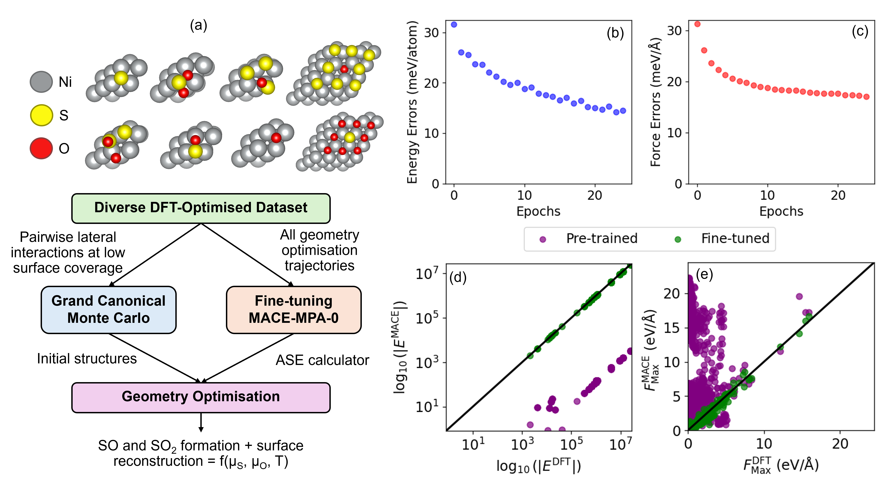

  <h1 align="center">Multiscale Modelling of Catalyst Poisoning</h1>

  <ul style="list-style-position: inside; text-align: center; padding: 0; margin: 10px 0;">
    <li style="margin-bottom: 8px;">
      This repository contains research code for the Catalysis Science & Technology article: <a href="https://doi.org/10.1039/D5CY01279A" target="_blank" style="text-decoration: none; font-weight: bold; color: black;">
        <em>Ab initio</em> insights into support-induced sulfur resistance in Ni-based reforming catalysts  
    </li>
    <li>
      All output files from Monte Carlo sampling and input/output files for MACE fine-tuning and inferencing have been uploaded to Figshare at the DOI: <a href="https://doi.org/10.6084/m9.figshare.29562377" target="_blank" style="color: #1a73e8; text-decoration: none;">https://doi.org/10.6084/m9.figshare.29562377</a>
    </li>
  </ul>

  <h2 align="center" style="margin-top: 10px; color: #333;">
  Overview
  </h2>
  

    
     
    <em>Integrating Grand Canonical Monte Carlo sampling and geometry optimisation using a MACE machine learned interatomic potential for simulating multicomponent adsorption at high surface coverage.</em>
  

