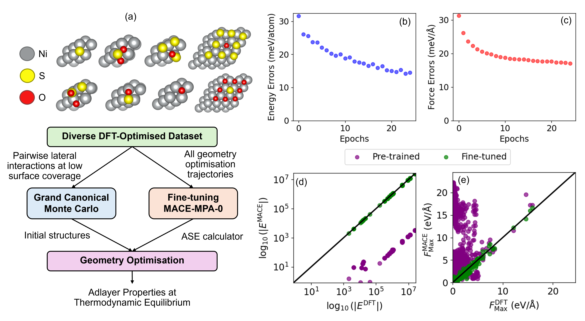

  <h1 align="center">Monte Carlo Sampling and ML Interatomic Potentials</h1>
  

    This repository contains data from the publication (under review): Support oxygen buffering as a mechanism for sulfur resistance in Ni-based reforming catalysts
  

  

    
     
    <em>Integrating Grand Canonical Monte Carlo sampling and geometry optimisation using a MACE machine learned interatomic potential for simulating multicomponent adsorption at high surface coverage.</em>
  

